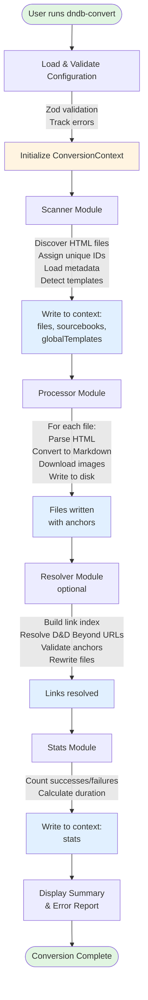

# RFC 0001: D&D Beyond HTML to Markdown Converter

**Status:** Accepted

**Author:** Alan Cunha

**Created:** 2025-11-15

**Updated:** 2025-11-20

> **Note:** This RFC represents the original design. The implementation has evolved—notably, the processor now uses a two-pass architecture instead of single-pass streaming to enable correct navigation titles. See [Performance](../performance.md) for current memory usage details.

## Summary

A CLI tool that converts D&D Beyond sourcebook HTML pages into clean, structured Markdown files suitable for note-taking applications like Obsidian. The tool uses unique ID-based file naming, downloads images locally, generates navigation links, and preserves D&D-specific formatting (stat blocks, spell descriptions, tables).

## Motivation

### Problem Statement

D&D Beyond provides excellent online access to D&D sourcebooks, but users often want to:

- Access content offline
- Take notes alongside official content
- Organize content in personal knowledge management systems (Obsidian, Notion, etc.)
- Search across all content efficiently
- Customize presentation and formatting

Manual conversion is time-consuming and error-prone. We need an automated solution that preserves the rich formatting and structure of D&D content while making it accessible in Markdown format.

### Goals

- Convert D&D Beyond HTML sourcebooks to clean, structured Markdown
- Preserve content hierarchy and D&D-specific formatting
- Download and organize images locally for offline access
- Generate navigation links between related content
- Provide unique, collision-free file naming
- Support customization through configuration and templates
- Handle errors gracefully and provide clear feedback

### Non-Goals

- Automated downloading from D&D Beyond (users manually save HTML pages)
- Real-time conversion or web scraping
- PDF generation or other output formats
- Reverse conversion (Markdown back to HTML)

## Architecture

### Pipeline Architecture

The converter uses a **pipeline architecture** where a shared context object flows through sequential modules. This design provides several benefits:

- **Simplicity**: Each module is a pure function that receives context, performs work, and writes results
- **Testability**: Modules can be tested independently with mock contexts
- **Flexibility**: Easy to add, remove, or reorder pipeline stages
- **Memory Efficiency**: Context contains only metadata, not full content

Each module follows the signature: `async fn(ctx: ConversionContext): Promise<void>`



### Context-Based Communication

A shared `ConversionContext` object flows through all modules, containing:

- **Configuration** - User settings and preferences
- **Tracker** - Unified stats and issue tracking
- **Pipeline Data** - File descriptors, sourcebook metadata, templates
- **Statistics** - Processing metrics via Tracker

The `Tracker` class provides:
- Counter methods for files, images, and links
- Issue tracking with typed reasons (file/image/resource/link)
- Automatic error classification (Zod errors, HTTP errors, file system errors)
- Final stats aggregation

This approach eliminates the need for complex module interfaces or message passing systems.

### Validation and Error Handling Strategy

**Runtime Validation with Zod:**

All user inputs are validated using Zod schemas for type safety:

- CLI command options
- Configuration files (default, user, custom)
- Sourcebook metadata files
- Mapping cache files

**Error Tracking:**

Errors are categorized and tracked in context rather than stopping execution:

- **File errors** - Processing failures for individual files
- **Image errors** - Download failures with retry logic
- **Resource errors** - Config/metadata validation failures

**Graceful Degradation:**

- Invalid configs → Fall back to defaults
- Invalid metadata → Use empty metadata
- Corrupted cache → Delete and rebuild
- Per-file failures → Continue to next file

All errors are displayed in a summary report after conversion completes.

### Memory-Efficient Processing

The processor module handles files **one at a time** to avoid memory bloat:

1. Parse HTML (in memory briefly)
2. Convert to Markdown (in memory briefly)
3. Download images
4. Write to disk immediately
5. Store only lightweight metadata
6. HTML/markdown garbage collected before next file

This approach allows processing large sourcebooks (50+ files, 100+ MB of content) without excessive memory usage.

## User Experience

### CLI Interface

Simple, intuitive command structure:

```bash
dndb-convert [options]

Options:
  -i, --input <path>    Input directory containing HTML files
  -o, --output <path>   Output directory for Markdown files
  -c, --config <path>   Path to custom config file
  --dry-run             Preview conversion without writing files
  -v, --verbose         Verbose output
```

### Configuration System

**Layered Configuration:**

Three-tier priority system:

1. Default config (built-in)
2. User config (OS-specific location)
3. Custom config (CLI flag)

Configs are deep-merged, allowing partial overrides while preserving defaults.

**OS-Specific Paths:**

Uses `env-paths` library for cross-platform compatibility:

- Linux: `~/.config/dndbeyond-importer/config.json` (XDG compliant)
- macOS: `~/Library/Preferences/dndbeyond-importer/config.json`
- Windows: `%APPDATA%\dndbeyond-importer\config.json`

**Configuration Sections:**

User-centric organization:

- `input` - Source HTML location and pattern
- `output` - Output directory and file settings
- `ids` - Unique ID generation settings
- `markdown` - Markdown formatting preferences (all Turndown options)
- `html` - HTML parsing settings
- `images` - Image download settings
- `links` - Link resolution configuration
- `logging` - Log level and progress display

### Template System

**Handlebars Templates:**

Allows full customization of output format:

- **Index templates** - Sourcebook table of contents
- **File templates** - Individual page layout

**Template Precedence:**

1. Sourcebook-specific templates (e.g., `input/players-handbook/file.md.hbs`)
2. Global templates (e.g., `input/file.md.hbs`)
3. Built-in defaults

Templates receive rich context with metadata, navigation, and content.

## Technology Choices

### Core Dependencies

**Zod** - Runtime type validation and schema inference

- Provides type safety beyond TypeScript compilation
- Clear error messages for invalid inputs
- Single source of truth for types (via `z.infer`)

**Turndown** - HTML to Markdown conversion

- Industry-standard converter
- Extensible rule system for custom formatting
- Respects user's markdown style preferences

**Cheerio** - HTML parsing and manipulation

- Fast, jQuery-like API for server-side HTML
- Efficient for extracting content and building anchor mappings
- Allows preprocessing before Turndown conversion

**Handlebars** - Template engine

- Simple, logic-less templates
- Widely adopted with good documentation
- Allows users to fully customize output format

**Commander.js** - CLI argument parsing

- De facto standard for Node.js CLIs
- Automatic help generation
- Type-safe option handling

**short-unique-id** - Unique ID generation

- Fast generation of collision-resistant IDs
- Configurable length and character set
- Maintains set of used IDs to prevent duplicates

**env-paths** - Cross-platform config paths

- Automatic XDG Base Directory compliance on Linux
- Handles platform differences transparently
- Well-maintained, focused library

**axios** - Image downloading

- Robust HTTP client with retry support
- Stream support for large files
- Good error handling

### Why Zod for Validation

TypeScript provides compile-time type safety, but user inputs arrive at runtime. Zod bridges this gap:

- Validates JSON configs, CLI args, and metadata files
- Provides clear, user-friendly error messages
- Enables type inference (no duplicate type definitions)
- Catches errors before they cause silent failures

### Why Handlebars for Templates

- **Simplicity**: Logic-less templates are easy to understand and maintain
- **Safety**: Can't execute arbitrary code
- **Familiarity**: Widely used, good documentation
- **Power**: Sufficient for our needs (variables, conditionals, loops)

### Why Context-Based Pipeline

Alternatives considered:

- **Event emitter pattern**: More complex, harder to test
- **Class-based modules**: More boilerplate, tighter coupling
- **Functional pipeline with return values**: Awkward with multiple outputs

Context-based approach is simple, testable, and flexible.

## Design Decisions

### Unique ID System

**Decision:** Use 4-character alphanumeric IDs for all files and images.

**Alternatives Considered:**

- Descriptive filenames (e.g., `chapter-1-introduction.md`)
- Sequential numbers (001, 002, etc.)
- Full UUIDs

**Rationale:**

- Short IDs are easy to type and remember
- Avoid filename conflicts and special character issues
- No renumbering when files are added/removed
- Better collision resistance than sequential numbers
- More user-friendly than UUIDs

### Persistent Caching

**Decision:** Store mappings in JSON files (`files.json`, `images.json`) in output directory.

**Why:**

- Consistent IDs across conversion runs
- Avoid re-downloading images (bandwidth + time savings)
- Simple, human-readable format
- Easy to inspect and debug

**How:**

- First run: Generate random IDs and save mappings
- Subsequent runs: Load mappings and reuse existing IDs
- Corrupted files: Validate with Zod, delete if invalid, rebuild

### Link Resolution Strategy

**Decision:** Multi-stage resolution with entity-aware routing, URL aliasing, and smart anchor matching.

**Architecture:**

The link resolution system uses a three-stage pipeline:

1. **Scanner** - Discovers files and extracts canonical URLs
2. **Processor** - Builds anchors and extracts entity URLs from HTML
3. **Resolver** - Resolves links using entity index and URL mapping

**Key Concepts:**

- **Entity Index** - Maps entity URLs (spells, monsters, etc.) to file locations
- **Entity Locations** - Config that routes entity types to specific source pages
- **URL Aliasing** - Maps alternate URLs to canonical forms (Free Rules → PHB)
- **Smart Anchor Matching** - Handles plural/singular variants and prefix matching

**Rationale:**

- **Entity-aware routing** - Prevents spells resolving to monster pages with matching anchors
- **URL normalization** - Single canonical URL per page simplifies resolution
- **Automatic validation** - Broken links fall back gracefully
- **Configurable fallback** - Users choose bold, italic, plain, or keep original
- **Memory efficient** - Processes one file at a time

**Configuration:**

```json
{
  "links": {
    "resolveInternal": true,
    "fallbackStyle": "bold",
    "urlAliases": { /* URL → canonical URL */ },
    "entityLocations": {
      "spells": ["/sources/dnd/phb-2024/spell-descriptions"],
      "monsters": ["/sources/dnd/mm-2024/monsters-a", ...]
    }
  }
}
```

See `docs/resolver.md` for detailed implementation documentation.

### HTML Preprocessing vs Turndown Rules

**Decision:** Fix structural HTML issues before Turndown conversion.

**Why:**

D&D Beyond HTML contains patterns that violate HTML spec but are consistent:

- Lists as siblings instead of children (e.g., `<ol><li>...</li><ul>...</ul></ol>`)

**Approach:**

1. **HTML Preprocessing** (in processor, before Turndown):
   - Fix structural issues using Cheerio DOM manipulation
   - Prevents Turndown from seeing invalid structure

2. **Turndown Rules** (during conversion):
   - Handle D&D Beyond content patterns (tables, figures, asides)
   - Format valid HTML into specific markdown patterns

**Rationale:**

- Turndown expects valid HTML structure
- DOM manipulation during Turndown can cause content loss
- Preprocessing ensures Turndown sees correct structure from the start

### Table Handling

**Decision:** Custom Turndown rule for complex table patterns.

**D&D Beyond Table Complexity:**

- Rowspan cells in their own `<tr>` (non-standard pattern)
- Multiple header rows with colspan grouping
- Section dividers within tbody using colspan
- Caption and footer extraction

**Why Custom Rule:**

- Full control over markdown generation
- Can walk through table structure systematically
- Handles all edge cases in single location
- No risk of breaking HTML structure

**Validation:** 576 tables across PHB, DMG, MM tested and working.

## Alternatives Considered

### Alternative 1: Normalized Heading Levels

**Considered:** Normalizing all heading levels to start at H1 for consistency.

**Rejected:** Preserving source heading levels maintains the original document structure and hierarchy. Users can adjust in their knowledge management tool if needed.

### Alternative 2: Convert Links to Bold Text

**Considered:** Converting all internal links to bold text to match PDF style.

**Rejected:** Markdown links preserve navigation and user experience. With URL mapping and anchor validation, we can maintain offline navigation while keeping everything local.

### Alternative 3: Image Subdirectory

**Considered:** Storing images in a separate `images/` subdirectory.

**Rejected:** Keeping images in the same directory as markdown files simplifies references, organization, and portability. Users can see all sourcebook content in one directory.

### Alternative 4: Descriptive Filenames

**Considered:** Using descriptive filenames based on chapter titles (e.g., `chapter-1-character-creation.md`).

**Rejected:** Unique IDs are more robust, avoid filename conflicts, and prevent issues with special characters or long titles. Descriptive information goes in frontmatter.

### Alternative 5: Sequential Numeric IDs

**Considered:** Using sequential numbers (001, 002, etc.) for file IDs.

**Rejected:** Short unique IDs avoid renumbering when files are added/removed and provide better collision resistance. Sequential IDs require careful management.

### Alternative 6: Manual OS Detection for Config Paths

**Considered:** Manually detecting OS and building config paths with custom logic.

**Rejected:** Using `env-paths` library provides automatic XDG compliance, handles platform differences, and is well-maintained. Don't reinvent the wheel.

### Alternative 7: Class-Based Module Architecture

**Considered:** Using classes for modules with shared state and methods.

**Rejected:** Simple functions with context parameter are easier to test, have no hidden dependencies, and require less boilerplate. Context object provides all needed state.

### Alternative 8: Process All Files Then Write

**Considered:** Processing all files into memory, then writing in a separate stage.

**Rejected:** Memory-inefficient for large sourcebooks. Processing and writing one file at a time keeps memory usage constant regardless of sourcebook size.

## Success Metrics

The solution is successful if it:

1. **Correctly converts** all D&D Beyond HTML content to valid Markdown
2. **Preserves formatting** for D&D-specific content (tables, stat blocks, spells)
3. **Handles errors gracefully** without stopping the entire conversion
4. **Provides clear feedback** on what succeeded and what failed
5. **Reuses cached data** to avoid unnecessary downloads
6. **Generates consistent IDs** across multiple conversion runs
7. **Resolves links accurately** with anchor validation
8. **Allows customization** through config and templates

## Testing Strategy

### Validation Testing

- Test all Zod schemas with valid and invalid inputs
- Verify error messages are clear and actionable
- Test graceful degradation for each error category

### Conversion Testing

- Test with real D&D Beyond HTML files (included in `examples/`)
- Verify all formatting patterns are preserved (tables, lists, headings)
- Test custom Turndown rules with edge cases
- Compare output with expected results

### Caching Testing

- Verify IDs remain consistent across runs
- Test corrupted cache detection and recovery
- Verify image download is skipped when cached

### Integration Testing

- Full conversion runs with example sourcebooks
- Verify all pipeline stages execute correctly
- Test error tracking and summary display
- Verify template rendering with custom templates

### Performance Testing

- Memory usage remains constant regardless of sourcebook size
- Large sourcebooks (50+ files) convert successfully
- Image download respects retries and timeouts

## Implementation Notes

For implementation details, type definitions, file structure, and coding conventions, see `CLAUDE.md` in the repository root.

## Future Enhancements

Potential future improvements (out of scope for initial implementation):

- Dry-run mode to preview conversion
- Interactive mode to resolve link ambiguities
- Plugin system for custom content transformations
- Support for other output formats (PDF, HTML)
- Automated link detection without URL mapping
- Incremental conversion (only process changed files)

## Conclusion

This architecture provides a solid foundation for converting D&D Beyond HTML to Markdown while maintaining flexibility for future enhancements. The pipeline design is simple and testable, the validation strategy catches errors early, and the memory-efficient approach handles large sourcebooks effectively.
